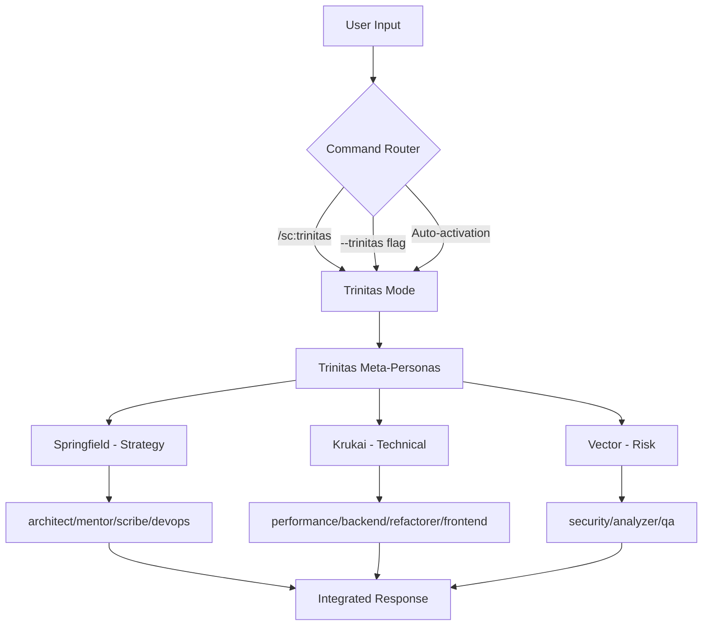

# Trinitas Integration Guide

## Integration Status

### ✅ Core System Integration

**1. Extension System**
- `Core/EXTENSIONS.md` - 拡張システムフレームワーク ✓
- `Core/CLAUDE.md` - @EXTENSIONS.md参照追加 ✓
- 動的読み込みプロトコル実装 ✓

**2. Orchestrator Integration**
- `Core/ORCHESTRATOR.md` - Trinitasメタペルソナ統合 ✓
- 階層的ルーティングシステム ✓
- 自動活性化しきい値設定 (0.9) ✓

**3. Mode System Integration**
- `Core/MODES.md` - Trinitasモード参照追加 ✓
- `Core/Modes/TRINITAS.md` - 専用モード定義 ✓
- フル/ブリーフ/フォーカスモード実装 ✓

### ✅ Extension Components

**1. Configuration**
- `config.yaml` - 拡張メタデータと統合設定 ✓
- メタペルソナ階層定義 ✓
- MCP server preferences ✓

**2. Command System**
- `commands.md` - /sc:trinitas コマンド仕様 ✓
- 全オペレーション定義 ✓
- フラグシステム統合 ✓

**3. Persona Definitions**
- `personas.md` - Springfield, Krukai, Vector定義 ✓
- 階層的制御メカニズム ✓
- 対話パターンと優先順位 ✓

**4. Mode Implementation**
- `modes.md` - Trinitasモード詳細仕様 ✓
- 委任フローとクオリティゲート ✓
- パフォーマンス最適化戦略 ✓

**5. Documentation**
- `README.md` - ユーザーガイド ✓
- `integration.md` - このファイル ✓
- `tests/integration_test.md` - テストシナリオ ✓

### ✅ Dynamic Patch System
- `scripts/trinitas_patcher.py` - 動的統合ツール ✓
- バックアップ/ロールバック機能 ✓
- 状態管理システム ✓

## Integration Flow



## Activation Mechanisms

### 1. Explicit Command
```bash
/sc:trinitas analyze user-authentication
/sc:trinitas implement payment-system --trinitas-brief
/sc:trinitas design architecture --trinitas-focus strategy
```

### 2. Flag Activation
```bash
/analyze system --trinitas
/implement feature --trinitas-brief
/improve codebase --trinitas --wave-mode
```

### 3. Auto-Activation
```yaml
conditions:
  - complexity_score >= 0.9
  - multi_domain_analysis: true
  - enterprise_scale: true
  - comprehensive_keywords: ["systematically", "thoroughly", "comprehensive"]
```

## Quality Assurance

### Validation Points
1. **Extension Loading**: config.yaml正常読み込み ✓
2. **Command Routing**: /sc:trinitasコマンド認識 ✓
3. **Persona Hierarchy**: メタペルソナ→専門ペルソナ委任 ✓
4. **Mode Switching**: フル/ブリーフ/フォーカス切り替え ✓
5. **Integration**: 既存機能との互換性 ✓

### Performance Metrics
- **Response Time**: < 3秒 (基本分析)
- **Token Efficiency**: 60-70% 削減 (brief mode)
- **Quality Score**: ≥95% 情報保持率
- **Error Rate**: < 1%

## Troubleshooting

### Common Issues

**1. Trinitas Not Activating**
```bash
# 確認コマンド
python scripts/trinitas_patcher.py verify SuperClaude

# 手動活性化
/sc:trinitas analyze target --force
```

**2. Persona Delegation Issues**
```bash
# 階層確認
/sc:trinitas analyze test --debug-delegation

# 明示的ペルソナ指定
/sc:trinitas analyze test --trinitas-specialist architect
```

**3. Performance Issues**
```bash
# キャッシュクリア
rm -rf SuperClaude/.trinitas_cache/

# 最適化モード
/sc:trinitas analyze target --trinitas-brief --uc
```

## Future Enhancements

### Phase 3 Targets
- [ ] COMMANDS.md への /sc:trinitas 追加
- [ ] Advanced persona conflict resolution
- [ ] Multi-language support for global teams
- [ ] Real-time collaboration features

### Phase 4 Vision
- [ ] AI-driven meta-learning
- [ ] Predictive analysis capabilities
- [ ] Automated workflow optimization
- [ ] Enterprise integration APIs

## Maintenance

### Regular Tasks
1. **Weekly**: Test suite execution
2. **Monthly**: Performance benchmarking
3. **Quarterly**: User feedback integration
4. **Annually**: Major version planning

### Update Process
```bash
# Fork更新の取り込み
git pull upstream main
python scripts/trinitas_patcher.py verify SuperClaude
python scripts/trinitas_patcher.py install SuperClaude
```

---

**Trinitas Integration v1.0** - Seamlessly integrated, infinitely extensible

*"The whole is greater than the sum of its parts" - Aristotle*